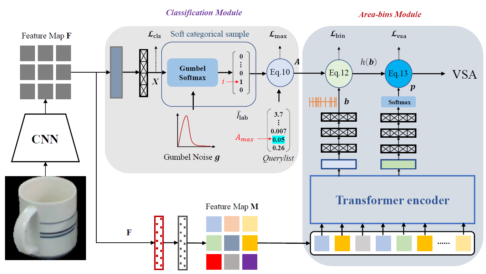

## Getting Started

#### Dependencies

- Python == 3.6.5
- torch == 1.8.1
- torchvision == 0.2.0
- cuda == 10.2.89
- cudnn == 7.6.5
- pytorch3d == 0.6.1
- imageio
- numpy
- pillow 
- path

#### Dataset

VSA Estimation Dataset

- Dataset Directory

  ```
  |- dataset
  |   |---VSA Estimation Dataset
  |   |   |---Data
  |   |   |   |---V_chair.npy
  |   |   |   |---V_sofa.npy
  |   |   |   |---...
  |   |   |---train
  |   |   |   |---0000000.png
  |   |   |   |---0000000.txt
  |   |   |   |---...
  |   |   |---test
  |   |   |   |---0000000.png
  |   |   |   |---0000000.txt
  |   |   |   |---...
  ```
  
#### Train

```bash
cd VSAestimator-Code
python3 -m torch.distributed.launch train_VSAestimator.py
```
